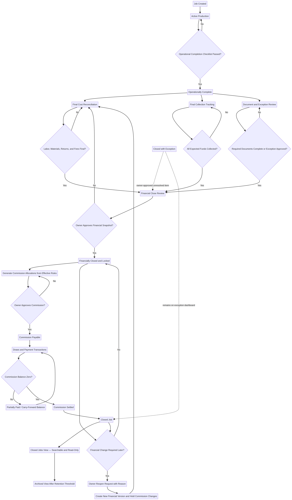

# JJ Roofing Robust Job Close and Commission Workflow

**Prepared by:** Manus AI  
**Purpose:** Define how JJ Roofing should complete, financially close, reopen, retain, and archive jobs without losing visibility or auditability.

## Executive recommendation

JJ Roofing should **not** use one generic “Closed” status. A roofing job can be physically finished while material returns remain unresolved, depreciation is uncollected, commission is unapproved, or commission payments remain outstanding. Treating all of those conditions as one status recreates the ambiguity in the spreadsheet.

The robust design separates five dimensions:

| Dimension              | What it answers                                                        |
| ---------------------- | ---------------------------------------------------------------------- |
| **Operational status** | Is the roofing work actually complete?                                 |
| **Cost status**        | Are labor, materials, returns, and fees final?                         |
| **Collection status**  | Has every expected dollar been collected?                              |
| **Commission status**  | Is commission ineligible, approved, partially paid, paid, or adjusted? |
| **Record state**       | Should the job appear in Active, Closed, or Archived views?            |

> **Recommended rule:** A job leaves the Active Jobs view only after operational completion, financial close, and commission-allocation approval. Commission payment can occur afterward through a separate payable ledger. Closed jobs remain searchable and visible; they are never moved to a disconnected file or deleted.

## Finalized profit and commission sequence

All costs and fees are applied **before** commission percentages. This is the correct calculation order based on the clarified JJ Roofing rules.[1]

> **Commissionable Profit = Final Collected Revenue − Final Labor − Final Materials − All Pre-Commission Fees and Adjustments**

> **Recipient Commission = Commissionable Profit × Recipient’s Effective Rate**

> **Company Profit = Commissionable Profit − Total Approved Commission Allocations**

No commission becomes eligible until the job is operationally complete, all costs and fees are final, all expected funds are collected, and an owner approves the financial close.

### Confirmed allocation patterns

| Seller                    | Seller commission | Justin override | Ian override | Your 10% share | Total allocated | Company residual |
| ------------------------- | ----------------: | --------------: | -----------: | -------------: | --------------: | ---------------: |
| **Justin**                |               50% |              0% |           0% |            10% |             60% |              40% |
| **Ian**                   |               50% |              0% |           0% |            10% |             60% |              40% |
| **Standard sales rep**    |               40% |             10% |          10% |            10% |             70% |              30% |
| **Charlie, as described** |               50% |             10% |          10% |            10% |         **80%** |          **20%** |

There is one remaining arithmetic conflict. The stated Charlie rule totals **80%**, although the intended maximum was described as 70%. The system can support either outcome, but this must be confirmed before the commission engine is implemented.

## The “Mark Job Complete” feature

The application should include a prominent **Mark Job Complete** action. This action should begin a controlled close process; it should not immediately lock the job or make commission payable.

When selected, it opens an operational completion checklist.

| Completion requirement                                             | Evidence or entry                  |
| ------------------------------------------------------------------ | ---------------------------------- |
| Contracted roofing scope is complete                               | Completion confirmation            |
| Approved supplements and change-order work are complete            | Checklist and linked change orders |
| Punch-list items and known callbacks are resolved                  | Resolution or approved exception   |
| Required inspection or permit step is complete                     | Status and optional document       |
| Completion photos are attached                                     | File links                         |
| Certificate of Completion is prepared or submitted when applicable | Submission date and document       |
| Customer-facing completion obligations are satisfied               | Confirmation or exception          |
| Actual completion date is entered                                  | Date                               |
| Authorized person confirms completion                              | User and timestamp                 |

Passing this checklist changes the job to **Operationally Complete**. It also activates cost reconciliation and final-collection tracking.

## Financial close gates

The **Close Financials** action should open a pre-close review page. The button remains disabled while any hard blocker exists.

| Gate                   | Passing condition                                           | Normal blocker behavior                     |
| ---------------------- | ----------------------------------------------------------- | ------------------------------------------- |
| Operational completion | Completion checklist approved                               | Return job to production/completion review  |
| Revenue reconciliation | Expected revenue matches received collections               | Show remaining collection and source        |
| Insurance depreciation | Final depreciation received for insurance jobs              | Keep in Depreciation Pending                |
| Labor finalization     | All labor charges approved and labor marked final           | Show unresolved labor entries               |
| Material finalization  | Purchases and returns reconciled and materials marked final | Show open returns or undocumented purchases |
| Fee finalization       | All pre-commission fees and adjustments approved            | Show pending fees and missing reasons       |
| Required documentation | Required records attached or exception approved             | Show missing document list                  |
| Profit review          | Commissionable Profit has no validation errors              | Show the exact calculation issue            |
| Owner attestation      | Authorized owner approves the complete snapshot             | Record approver and timestamp               |

### The financial snapshot

Approval creates an immutable **Financial Close Version**. The snapshot contains the final revenue, every approved cost category, fees and adjustments, Commissionable Profit, rate-rule IDs, calculated allocations, supporting-document references, approver, timestamp, and close reason.

The live job record remains readable, but ordinary edits to the approved financial inputs are disabled. This prevents a later material-cost change from silently altering profit and commission.

## Commission approval and job closing

After financial close, the application generates the proposed commission allocations from the rate settings effective for that job. An owner reviews and approves the allocations.

Once financial close and allocation approval are complete, the job becomes **Closed** and disappears from the default Active Jobs page. This does **not** mean the record disappears, and it does not require commission to have been paid already.

This separation is important:

| Status                        | Meaning                                                                             |
| ----------------------------- | ----------------------------------------------------------------------------------- |
| **Job Closed**                | Work, collections, costs, profit, and commission allocations are finalized          |
| **Commission Partially Paid** | The job is closed, but an approved commission liability remains                     |
| **Commission Paid**           | All approved commission payments and offsets are settled                            |
| **Archived**                  | The closed record is hidden from normal views but remains searchable and reportable |

A closed job with unpaid commission appears in the **Commission Payables** view, not in Active Jobs. This keeps the production list clean without hiding money that JJ Roofing still owes.

## Draws, advances, payments, and clawbacks

Draws and payments must be separate transactions. They must never overwrite earned commission.

| Required transaction field | Purpose                                          |
| -------------------------- | ------------------------------------------------ |
| Job ID                     | Ties the draw or payment to the funding job      |
| Recipient                  | Identifies the rep or owner                      |
| Transaction type           | Draw, payment, adjustment, clawback, or reversal |
| Amount                     | Numeric value                                    |
| Transaction date           | Establishes chronology                           |
| Reason                     | Required explanation                             |
| Entered by and entered at  | Establishes accountability                       |
| Payment/reference record   | Optional check, ACH, receipt, or note            |

> **Commission Balance = Approved Commission − Draws − Payments − Applied Clawbacks**

An overpayment creates a negative rep-ledger balance. Future commission allocations offset that balance. The original payment is never rewritten or deleted.

## Reopening a closed job

A closed job must be reopenable because returns, insurance corrections, warranty decisions, or accounting errors can emerge later. Reopening must be controlled rather than prohibited.

Only an authorized owner can select **Reopen Financials**. The action requires a reason, impact type, and supporting explanation. The prior Financial Close Version remains permanent, and the application creates a new working version.

| Reopen scenario                    | Required system behavior                                                  |
| ---------------------------------- | ------------------------------------------------------------------------- |
| Commission not approved            | Recalculate proposed allocations after revised close                      |
| Commission approved but unpaid     | Put affected commission on hold and generate the difference for review    |
| Commission partially or fully paid | Preserve payments and create a positive or negative commission adjustment |
| Additional material return         | Post a return transaction rather than overwrite the original purchase     |
| Missing vendor charge              | Post a new cost transaction with documentation                            |
| Revenue correction                 | Post a collection adjustment or reversal with reason                      |
| Closed with exception              | Preserve the exception until separately resolved                          |

After the correction, the same financial gates run again. Approval creates Financial Close Version 2. The job timeline clearly shows both versions and the impact on profit, company share, and each recipient’s commission.

## Closed and Archived views

Closed jobs should remain in the same database. “Moving to another page” should be implemented as a filtered view, not as copying rows to another table.

| View                       | Contents                                                                   |
| -------------------------- | -------------------------------------------------------------------------- |
| **Active Jobs**            | Jobs still in production, completion review, reconciliation, or collection |
| **Ready to Close**         | Jobs with all close gates satisfied                                        |
| **Closed Jobs**            | All finalized jobs, including commission-payment badges                    |
| **Closed with Exceptions** | Closed jobs with owner-approved unresolved items                           |
| **Reopened / Adjusted**    | Jobs whose approved financials changed after close                         |
| **Archived Jobs**          | Older closed jobs hidden from routine lists but fully searchable           |

Archiving should occur only after a configurable retention period and when no unresolved exception or unpaid commission remains. Archive changes visibility; it does not delete data or remove it from reporting.

## Controlled exceptions

A robust system needs exceptions, but exceptions cannot become a way to bypass every control. The **Close with Exception** action should be available only to owners and should require the following:

| Exception control           | Requirement                                                                                          |
| --------------------------- | ---------------------------------------------------------------------------------------------------- |
| Type                        | Missing document, disputed balance, pending nonfinancial item, write-off, or other approved category |
| Explanation                 | Required narrative                                                                                   |
| Owner                       | Person accountable for resolution                                                                    |
| Due date                    | Required follow-up date                                                                              |
| Financial impact or reserve | Required when money may change                                                                       |
| Approval                    | Owner approval; second owner for high-risk exceptions                                                |
| Visibility                  | Remains on the Needs Attention dashboard after closing                                               |
| Resolution                  | Separate resolution action with evidence and timestamp                                               |

Outstanding expected revenue should normally block financial close. A disputed balance or write-off is a high-risk exception and should require a second owner’s approval.

## Permission model

| Role                              | Enter transactions |      Finalize costs | Approve financial close | Approve commission | Reopen paid job | View company profit |
| --------------------------------- | -----------------: | ------------------: | ----------------------: | -----------------: | --------------: | ------------------: |
| **Owner administrator**           |                Yes |                 Yes |                     Yes |                Yes |             Yes |                 Yes |
| **Owner approver**                |                Yes |                 Yes |                     Yes |                Yes |             Yes |                 Yes |
| **Future office/accounting role** |                Yes | Submit for approval |                      No |                 No |              No |        Configurable |
| **Sales rep**                     | No financial edits |                  No |                      No |                 No |              No |                  No |
| **System**                        |    Calculates only |                  No |                      No |                 No |              No |                 N/A |

Sales representatives can optionally receive read-only access to their own jobs, estimated commission, approved commission, payments, draws, and remaining balance. They should not see company residual profit or another rep’s commission.

## High-risk actions requiring stronger approval

For a three-owner team, requiring two owners to approve every normal close may become unnecessarily slow. A better balance is one-owner approval for routine close and a second-owner approval for high-risk actions.

| High-risk action                            | Recommended control                         |
| ------------------------------------------- | ------------------------------------------- |
| Reopen a job after commission payment       | Second-owner approval                       |
| Write off expected revenue                  | Second-owner approval                       |
| Override a failed close gate                | Second-owner approval                       |
| Change a commission rate after job creation | Versioned setting and second-owner approval |
| Manually override calculated commission     | Required reason and second-owner approval   |
| Void or reverse a payment                   | Second-owner approval                       |
| Delete financial data                       | Prohibited; use void/reversal transactions  |

## Audit design

The application should maintain an append-only audit ledger and a readable activity timeline on each job. No authorized user should be able to edit prior audit entries.

Each event should record the entity, action, previous value, new value, user, timestamp, reason, approval, financial version, and source. Important events include job completion, cost creation or reversal, collection posting, category finalization, financial close, commission generation and approval, payment posting, settings changes, reopening, archive changes, and exception resolution.

The job page should answer four questions immediately:

| Question                           | Displayed evidence                                     |
| ---------------------------------- | ------------------------------------------------------ |
| Who last changed this?             | User and timestamp beside the current field or section |
| Was this amount approved as final? | Final badge, approver, and approval time               |
| What was the previous amount?      | Version history and old/new values                     |
| Why did it change?                 | Required change or reopen reason                       |

## Dashboards and automated exception monitoring

The application should use deterministic rules to identify incomplete or risky jobs. These checks run when records change and as routine background reviews.

| Dashboard card            | Example trigger                                                    |
| ------------------------- | ------------------------------------------------------------------ |
| **Completion Review**     | Work marked done but completion checklist incomplete               |
| **Costs Pending**         | Operationally complete while labor or materials remain provisional |
| **Depreciation Pending**  | COC submitted but final insurance collection has not arrived       |
| **Collections Short**     | Expected revenue exceeds total collected                           |
| **Ready to Close**        | All financial gates pass                                           |
| **Close Blocked**         | One or more named blockers remain                                  |
| **Commission Ready**      | Financial close approved but allocation not approved               |
| **Commission Payable**    | Approved commission balance is positive                            |
| **Negative Rep Balance**  | Clawback remains to be recovered from future jobs                  |
| **Closed with Exception** | Approved exception remains unresolved                              |
| **Reopened Jobs**         | A prior financial close is being revised                           |

Notifications should identify the exact blocker and link directly to the affected job. They should not rely on an owner remembering to inspect every record manually.

## Implementation choices

| Approach                                                                  | Tradeoffs                                                                      | Cost     | Setup Complexity |
| ------------------------------------------------------------------------- | ------------------------------------------------------------------------------ | -------- | ---------------- |
| **Single close button with archive filter**                               | Faster to implement, but easier to close incomplete jobs and weaker for audits | Low      | Low              |
| **Multi-stage close with gates and financial snapshots**                  | Strong control with practical day-to-day workflow                              | Moderate | Moderate         |
| **Multi-stage close with two-person approval for every close and reopen** | Maximum separation of duties, but slower for a three-owner operation           | Higher   | Higher           |

I recommend the **multi-stage close with gates and immutable financial snapshots**, with two-person approval reserved for the high-risk actions listed above. This is robust without making routine work unnecessarily burdensome.

## Remaining confirmation

Only one commission question remains:

> For a Charlie job, is the correct allocation **80% total**—Charlie 50%, Justin 10%, Ian 10%, and your 10%, leaving 20% to the company—or should one of those 10% shares not apply so the total remains 70%?

After that confirmation, the next deliverable should be the full **application requirements and data-model specification**, including tables, fields, formulas, validations, permissions, screens, workflow transitions, audit events, reports, and spreadsheet-migration rules.

## References

[1]: ./JJ_Roofing_App_Options_and_Requirements.md 'JJ Roofing App Options and Requirements — prior requirements summary and user clarification'
